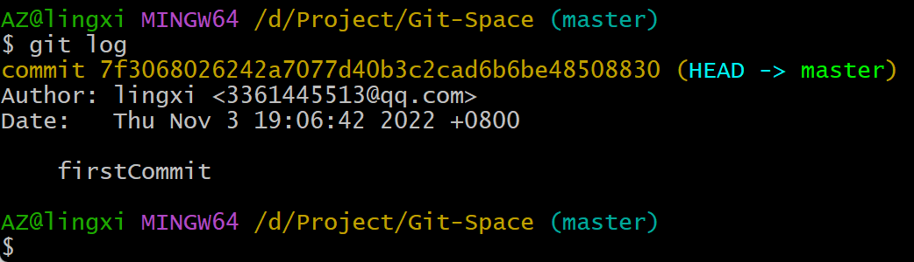
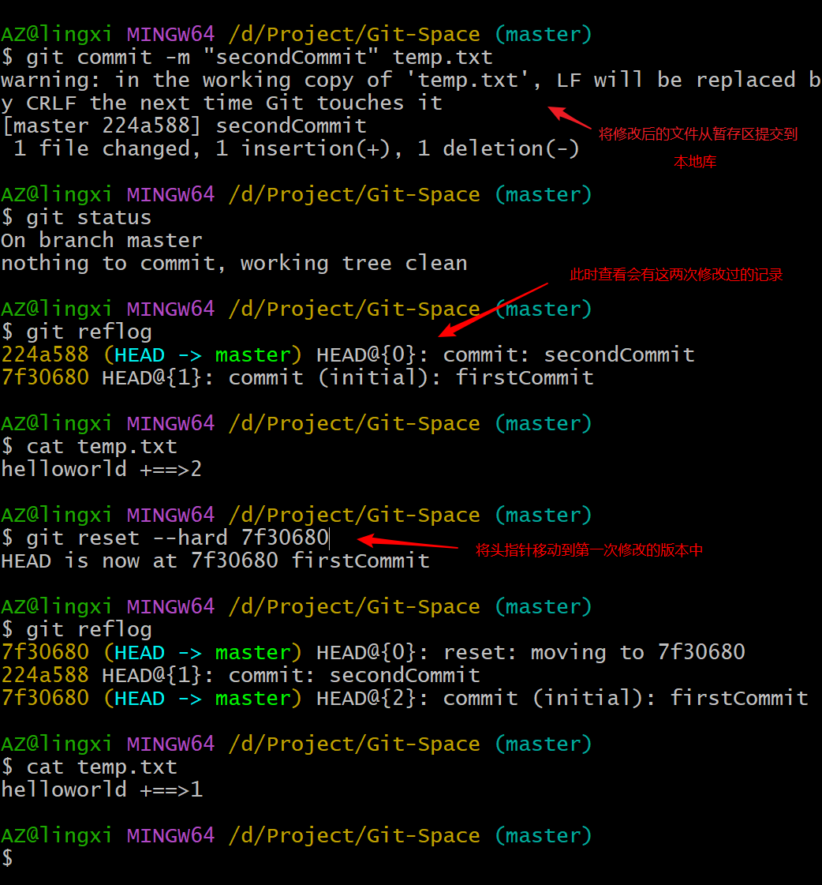

# git的概述

# 安装git


 


## git使用命令行更新软件
`**git update-git-for-windows**`
# git的常用命令
| 命令名称 | 作用 |
| --- | --- |
| git config --globa luser.name 用户名 | 设置用户签名 |
| git config --global user.email 邮箱 | 设置用户签名 |
| git init | 初始化本地库 |
| git status | 查看本地库状态 |
| git add 文件名 | 添加打暂存区 |
| git commit -m "日志信息" 文件名 | 提交到本地库 |
| git reflog | 查看历史记录 |
| git log --all --graph --decorate | 以图的形式查看日志 |
| git diff | 显示自上次提交之后发生的变动 |
| git reset --hard 版本号 | 版本穿梭 |

- 说明：签名的作用是区分不同操作者的身份，用户的签名信息在吗每一个版本中的提交信息中能够看到，以此确认本次提交是谁做的。Git首次的安装必须设置一下用户签名，否则无法提交代码。
- 注意，这里设置的用户签名和将来登录GitHub（或其他的代码托管中心）的账号没有任何关系。
## 初始化本地库

- `git init `
- 先进入到本地库目录（没有就随便创一个），再git init


## 查看本地库的状态

- `git status`
- 红的说明还没提交到暂存区


## 添加暂存区

- `git add <<filename>>`
- 绿色说明已经提交到了缓存区


## 将暂存区的文件提交到本地库

- `git commit -m "<<日志信息>>" <<要提交的文件>>`


## 查看引用日志信息

- `git reflog`==>查看历史版本的信息
- `git log` 	    ==>详细的日志信息


## 版本穿梭

- `git reset --hard <<版本号>>`::版本号能够通过`git reflog`命令查查到




# git分支
## 什么是分支


- 在版本控制的过程中，同时推进多个任务，为每个任务，我们就可以创建每个任务的单独分支。使用分支意味着程序员可以把自己的工作从开发主线上分离开来，开发自己分支的时候，不会影响到主线分支的运行。-分支底层其实也是指针的引用。


## 分支的操作
| 命令名称 | 作用 |
| --- | --- |
| git branch <分支名> | 创建分支 |
| git branch -v | 查看分支 |
| git checkout <分支名> | 切换分支 |
| git merge <分支名> | 把指定的分支合并到当前分支上 |

### 查看分支

- `git branch -v`
```git
$ git branch -v
* master 224a588 secondCommit
```
### 创建分支

- `git branch <分支名>`
```git
AZ@lingxi MINGW64 /d/Project/Git-Space (master)
$ git branch hot-fix

AZ@lingxi MINGW64 /d/Project/Git-Space (master)
$ git branch -v
  hot-fix 224a588 secondCommit
* master  224a588 secondCommit
```
### 切换分支

- `git checkout <要切换的分支名>`
```git
AZ@lingxi MINGW64 /d/Project/Git-Space (master)
$ git checkout hot-fix
Switched to branch 'hot-fix'

AZ@lingxi MINGW64 /d/Project/Git-Space (hot-fix)
$ git branch -v
  got-fix 224a588 secondCommit
* hot-fix 224a588 secondCommit
  master  224a588 secondCommit
```

- 前三点的运用的小栗子
```git
AZ@lingxi MINGW64 /d/Project/Git-Space (hot-fix)
$ git status
On branch hot-fix
Changes not staged for commit:
  (use "git add <file>..." to update what will be committed)
  (use "git restore <file>..." to discard changes in working directory)
        modified:   temp.txt

no changes added to commit (use "git add" and/or "git commit -a")

AZ@lingxi MINGW64 /d/Project/Git-Space (hot-fix)
$ git add temp.txt

AZ@lingxi MINGW64 /d/Project/Git-Space (hot-fix)
$ git commit -m "hot-fix first commit" temp.txt
[hot-fix 12b0edc] hot-fix first commit
 1 file changed, 1 insertion(+), 1 deletion(-)

AZ@lingxi MINGW64 /d/Project/Git-Space (hot-fix)
$ cat temp.txt
helloworld +==> hot--fix

AZ@lingxi MINGW64 /d/Project/Git-Space (hot-fix)
$ git reflog
12b0edc (HEAD -> hot-fix) HEAD@{0}: commit: hot-fix first commit
224a588 (master, got-fix) HEAD@{1}: checkout: moving from master to hot-fix
224a588 (master, got-fix) HEAD@{2}: reset: moving to 224a588
7f30680 HEAD@{3}: reset: moving to 7f30680
224a588 (master, got-fix) HEAD@{4}: commit: secondCommit
7f30680 HEAD@{5}: commit (initial): firstCommit

AZ@lingxi MINGW64 /d/Project/Git-Space (hot-fix)
$ git checkout master
Switched to branch 'master'

AZ@lingxi MINGW64 /d/Project/Git-Space (master)
$ cat temp.txt
helloworld +==>2
```
### 合并分支

- `git merge <分支名>`
1. 正常合并
```git
AZ@lingxi MINGW64 /d/Project/Git-Space (master)
$ git merge fot-fix
merge: fot-fix - not something we can merge

AZ@lingxi MINGW64 /d/Project/Git-Space (master)
$ git merge hot-fix
Updating 224a588..12b0edc
Fast-forward
 temp.txt | 2 +-
 1 file changed, 1 insertion(+), 1 deletion(-)

AZ@lingxi MINGW64 /d/Project/Git-Space (master)
$ cat temp.txt
helloworld +==> hot--fix

```

2. 冲突合并
- 冲突产生的原因：合并分支时，两个分支在同一个文件的同一个位置有两套完全不同的修改。git无法替我们决定使用哪一个。必须人为的决定新代码的内容
```git
AZ@lingxi MINGW64 /d/Project/Git-Space (master)
$ vim temp.txt

AZ@lingxi MINGW64 /d/Project/Git-Space (master)
$ cat temp.txt
helloworld +==> master modify

AZ@lingxi MINGW64 /d/Project/Git-Space (master)
$ git add temp.txt

AZ@lingxi MINGW64 /d/Project/Git-Space (master)
$ git commit -m "master test" temp.txt
[master 63f3bb4] master test
 1 file changed, 1 insertion(+), 1 deletion(-)

AZ@lingxi MINGW64 /d/Project/Git-Space (master)
$ git status
On branch master
nothing to commit, working tree clean

AZ@lingxi MINGW64 /d/Project/Git-Space (master)
$ cat temp.txt
helloworld +==> master modify

AZ@lingxi MINGW64 /d/Project/Git-Space (master)
$ git checkout hot-fix
Switched to branch 'hot-fix'

AZ@lingxi MINGW64 /d/Project/Git-Space (hot-fix)
$ cat temp.txt
helloworld +==> hot--fix

AZ@lingxi MINGW64 /d/Project/Git-Space (hot-fix)
$ vim temp.txt

AZ@lingxi MINGW64 /d/Project/Git-Space (hot-fix)
$ cat temp.txt
helloworld +==> hot--fix <test> and branch

AZ@lingxi MINGW64 /d/Project/Git-Space (hot-fix)
$ git add temp.txt

AZ@lingxi MINGW64 /d/Project/Git-Space (hot-fix)
$ git commit -m "hot-fix test" temp.txt
[hot-fix a127982] hot-fix test
 1 file changed, 1 insertion(+), 1 deletion(-)

AZ@lingxi MINGW64 /d/Project/Git-Space (hot-fix)
$ git checkout master
Switched to branch 'master'

#这里合并代码产生了冲突CONFLICT (content)
AZ@lingxi MINGW64 /d/Project/Git-Space (master)
$ git merge hot-fix
Auto-merging temp.txt
CONFLICT (content): Merge conflict in temp.txt
Automatic merge failed; fix conflicts and then commit the result.

AZ@lingxi MINGW64 /d/Project/Git-Space (master|MERGING)
$ git status
On branch master
You have unmerged paths.
  (fix conflicts and run "git commit")
  (use "git merge --abort" to abort the merge)

Unmerged paths:
  (use "git add <file>..." to mark resolution)
        both modified:   temp.txt

no changes added to commit (use "git add" and/or "git commit -a")

#这里将代码进行了手动合并
AZ@lingxi MINGW64 /d/Project/Git-Space (master|MERGING)
$ vim temp.txt

AZ@lingxi MINGW64 /d/Project/Git-Space (master|MERGING)
$ cat temp.txt
helloworld +==> master modify
helloworld +==> hot--fix <test> and branch

#这里会进行报错，commit 手动合并的时候不需要加上文件名
AZ@lingxi MINGW64 /d/Project/Git-Space (master|MERGING)
$ git commit -m "merge test" temp.txt
fatal: cannot do a partial commit during a merge.

AZ@lingxi MINGW64 /d/Project/Git-Space (master|MERGING)
$ git commit -m "merge test"
[master 5b5e5e3] merge test

AZ@lingxi MINGW64 /d/Project/Git-Space (master)
$ git status
On branch master
nothing to commit, working tree clean

AZ@lingxi MINGW64 /d/Project/Git-Space (master)
$ cat temp.txt
helloworld +==> master modify
helloworld +==> hot--fix <test> and branch

```
# gitHub操作
## 远程仓库操作
| 命令名称 | 作用 |
| --- | --- |
| git remote -v | 查看当前所有远程地址别名 |
| git remote add 别名 远程地址 | 起别名 |
| git push 别名 分支 | 推送本地分支上的内容到远程仓库 |
| git clone 远程地址 | 将远程仓库的内容克隆到本地 |
| git pull 远程库地址别名 | 将远程仓库对于分支最新内容拉下来后与当前本地分支直接合并 |

### 创建远程库别名

- `git remote -v`
```git
AZ@lingxi MINGW64 /d/Project/Git-Space/git-demo (master)
$ git remote -v
```
### 创建别名

- `git remote add <别名> <git上远程库的地址>`
```git
AZ@lingxi MINGW64 /d/Project/Git-Space/git-demo (master)
$ git remote add git-demo https://github.com/H-liang-end/git-demo.git

AZ@lingxi MINGW64 /d/Project/Git-Space/git-demo (master)
$ git remote -v
git-demo        https://github.com/H-liang-end/git-demo.git (fetch)
git-demo        https://github.com/H-liang-end/git-demo.git (push)
```
### 将本地库推送到github

- `git push <别名 or 远程库的地址名> <要提交的分支>`
```git
AZ@lingxi MINGW64 /d/Project/Git-Space/git-demo (master)
$ git reflog
64450d3 (HEAD -> master) HEAD@{0}: commit (initial): first commit

AZ@lingxi MINGW64 /d/Project/Git-Space/git-demo (master)
$ cat hello.txt
i love you if you love me

AZ@lingxi MINGW64 /d/Project/Git-Space/git-demo (master)
$ git push git-demo master
Enumerating objects: 3, done.
Counting objects: 100% (3/3), done.
Writing objects: 100% (3/3), 225 bytes | 225.00 KiB/s, done.
Total 3 (delta 0), reused 0 (delta 0), pack-reused 0
To https://github.com/H-liang-end/git-demo.git
 * [new branch]      master -> master
```
### 将网上的代码库拉取到本地库

- `git pull <别名 or 远程库的地址名> <要拉取的分支>`
```git
AZ@lingxi MINGW64 /d/Project/Git-Space/git-demo (master)
$ git pull git-demo master
remote: Enumerating objects: 5, done.
remote: Counting objects: 100% (5/5), done.
remote: Total 3 (delta 0), reused 0 (delta 0), pack-reused 0
Unpacking objects: 100% (3/3), 658 bytes | 94.00 KiB/s, done.
From https://github.com/H-liang-end/git-demo
 * branch            master     -> FETCH_HEAD
   64450d3..466a6d1  master     -> git-demo/master
Updating 64450d3..466a6d1
Fast-forward
 hello.txt | 3 ++-
 1 file changed, 2 insertions(+), 1 deletion(-)

AZ@lingxi MINGW64 /d/Project/Git-Space/git-demo (master)
$ git status
On branch master
nothing to commit, working tree clean

AZ@lingxi MINGW64 /d/Project/Git-Space/git-demo (master)
$ cat hello.txt
i love you if you love me
thus,i can't love you!

```
### 将远程代码克隆到本地库

- `git clone <远程库的地址名>` 

克隆会进行如下操作

1. 拉取代码
2. 初始化本地库
3. 创建别名
```git
AZ@lingxi MINGW64 /d/Project/Git-Space/git-demo (master)
$ git clone https://github.com/traceJP/setuDownLoad.git
Cloning into 'setuDownLoad'...
remote: Enumerating objects: 61, done.
remote: Counting objects: 100% (61/61), done.
remote: Compressing objects: 100% (38/38), done.
remote: Total 61 (delta 10), reused 60 (delta 9), pack-reused 0
Receiving objects: 100% (61/61), 16.79 KiB | 209.00 KiB/s, done.
Resolving deltas: 100% (10/10), done.
AZ@lingxi MINGW64 /d/Project/Git-Space/git-demo (master)
$ git status
On branch master
Untracked files:
  (use "git add <file>..." to include in what will be committed)
        setuDownLoad/

nothing added to commit but untracked files present (use "git add" to track)

AZ@lingxi MINGW64 /d/Project/Git-Space/git-demo (master)
$ cd setuDownLoad/

#这里取了别名
AZ@lingxi MINGW64 /d/Project/Git-Space/git-demo/setuDownLoad (master)
$ git remote -v
origin  https://github.com/traceJP/setuDownLoad.git (fetch)
origin  https://github.com/traceJP/setuDownLoad.git (push)
```
## ssh免密登录

1. 先在用户的文件夹下面打开git bash
2. `$ ssh-keygen -t rsa -C <git hub 邮箱>`生成.ssh文件夹
```git
$ ssh-keygen -t rsa -C 3361445513@qq.com
Generating public/private rsa key pair.
Enter file in which to save the key (/c/Users/AZ/.ssh/id_rsa):
Created directory '/c/Users/AZ/.ssh'.
Enter passphrase (empty for no passphrase):
Enter same passphrase again:
Your identification has been saved in /c/Users/AZ/.ssh/id_rsa
Your public key has been saved in /c/Users/AZ/.ssh/id_rsa.pub
The key fingerprint is:
SHA256:EqOuxQdJD7mzf8FkOt7NLGenwHpmDpi4lxvmE7S+DMQ 3361445513@qq.com
The key's randomart image is:
+---[RSA 3072]----+
|                 |
|     .           |
|    + o          |
| . ..* oo        |
|  E.*.o=S        |
| . +o*ooo        |
|  o.X+ooo=       |
|   O=+.oB.* .    |
|  o.=+o*.+.o     |
+----[SHA256]-----+
```

3. 里面会有一个公钥id_rsa.pub和一个私钥id_rsa
4. 复制公钥到GitHub的设置`ssh and GPG keys`上


# 官方指导
```git
echo "# H-liang-end" >> README.md
git init
git add README.md
git commit -m "first commit"
git branch -M main
git remote add origin git@github.com:H-liang-end/H-liang-end.git
git push -u origin main
```
